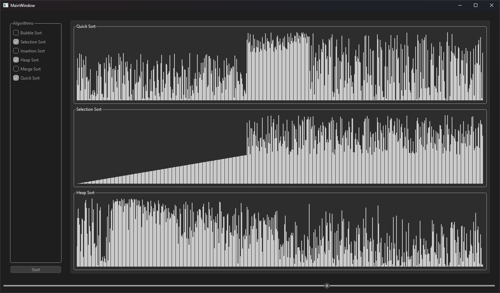

# Sorting Algorithms Visualizer

Questo software offre un'interfaccia intuitiva per visualizzare e comprendere il funzionamento degli algoritmi di ordinamento. Grazie ad animazioni passo-passo, è possibile esplorare il comportamento e l'efficienza di algoritmi come Bubble Sort, Merge Sort, Quick Sort e molti altri.

## Caratteristiche
- Visualizzazione animata degli algoritmi di sort.
- Possibilità di scegliere il numero di elementi da ordinare.
- Selezione di uno o più algoritmi da eseguire contemporaneamente.
- Interfaccia semplice e interattiva.

## Anteprima

